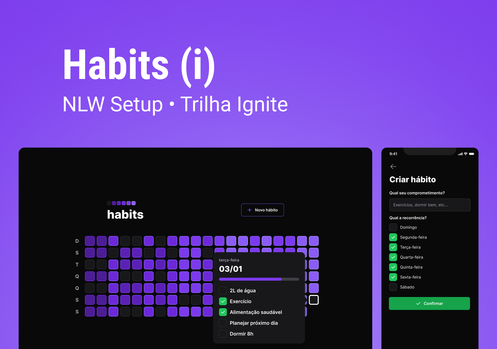

<h1 align="center"> NLW Setup Ignite </h1>

Evento exclusivo e gratuito, promovido pela Rocketseat para ensino de tecnologias WEB.

  <a href="#-tecnologias">Tecnologias</a>&nbsp;&nbsp;&nbsp;|&nbsp;&nbsp;&nbsp;
  <a href="#-projeto">Projeto</a>&nbsp;&nbsp;&nbsp;|&nbsp;&nbsp;&nbsp;
  <a href="#-layout">Layout</a>

 

  

 

## 🚀 Tecnologias

Esse projeto foi desenvolvido com as seguintes tecnologias:

- HTML e TypeScript
- [Tailwindcss](https://tailwindcss.com/) para a estilização
- [Fastify](https://www.fastify.io/) framework web bem parecido com o express
- [Prisma](https://www.prisma.io/) para comunicar com o banco de dados SQLite
- [Vite](https://vitejs.dev/) ambiente de desenvolvimento simples e super rápido
- [Expo](https://expo.dev/) ferramenta utilizada no desenvolvimento mobile com React Native
- [NativeWind](https://www.nativewind.dev/) utilizado para estilizar no react-native
- [Radix](https://www.radix-ui.com/) criação de componentes com acessibilidade

E muitas outras que foram utilizadas furante o projeto.

 

## 💻 Projeto

O Habits é um projeto para a criação de uma aplicação web e um aplicativo para smartphone que ajuda a manter hábitos, onde é possível cadastrar novos hábitos, atualizar quais hábitos foram feito durante o dia e visualizar de forma gráfica a performance durante os dias pela cor.

 

## 🔖 Layout

Você pode visualizar o layout do projeto através [DESSE LINK](https://www.figma.com/community/file/1195326661124171197/duplicate). É necessário ter conta no [Figma](https://figma.com) para acessá-lo.

---

Feito com ♥ by Rocketseat :wave: [Participe da nossa comunidade!](https://discord.gg/rocketseat)
